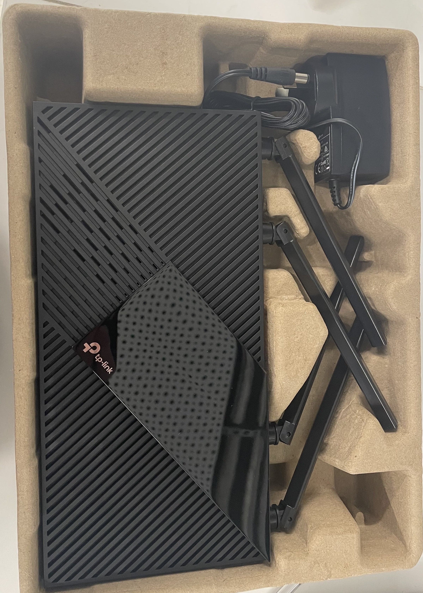
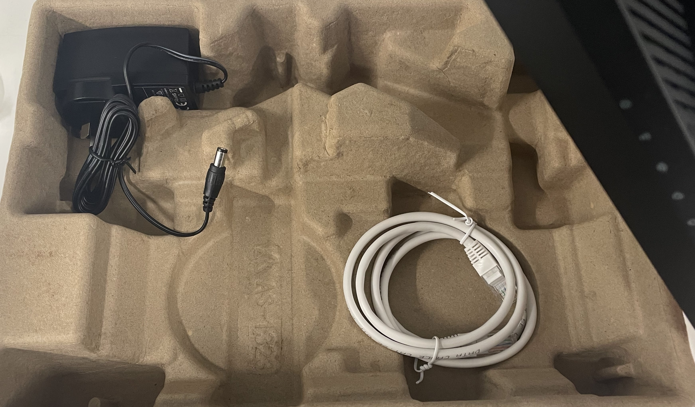
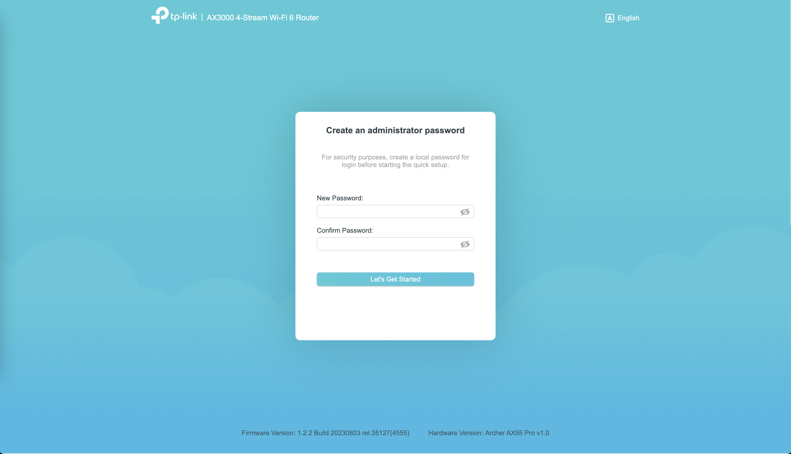
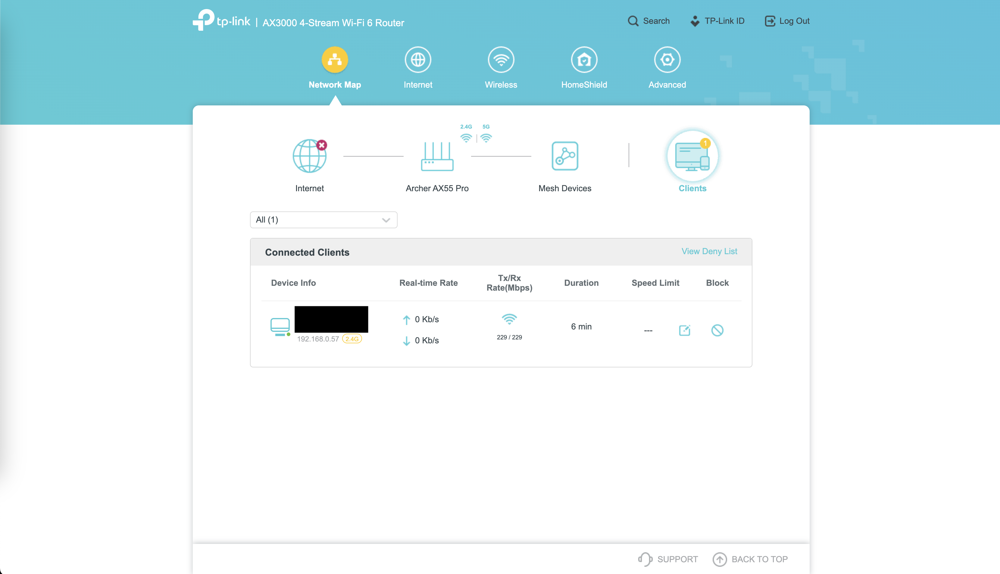
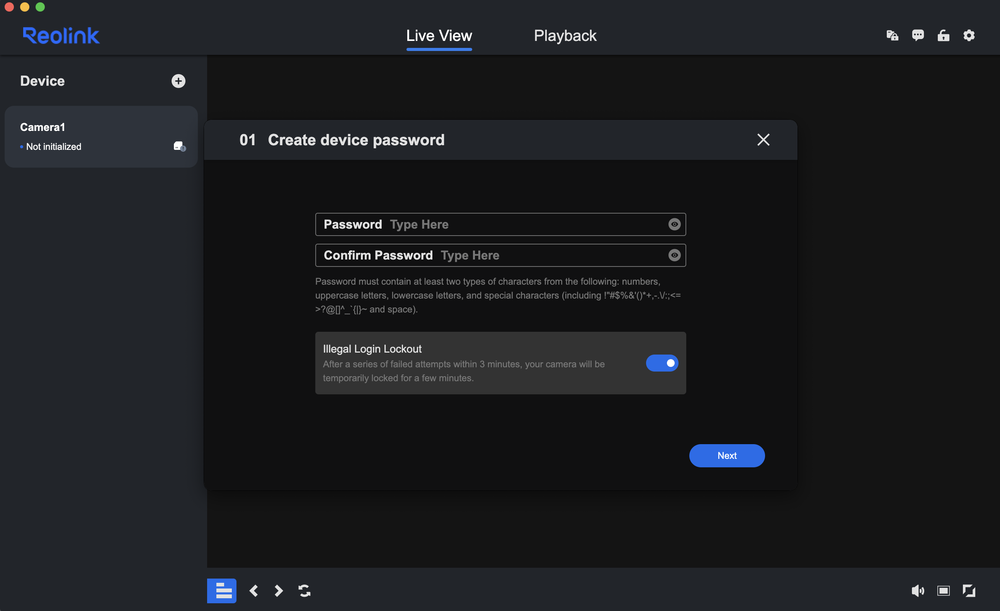
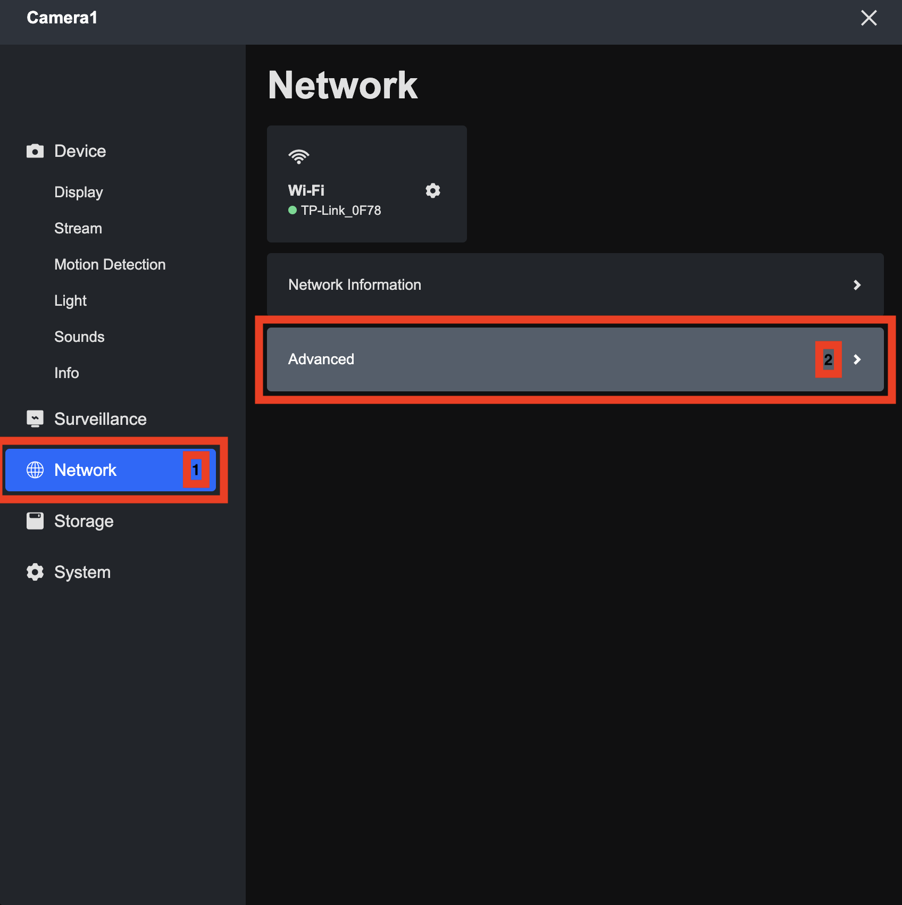
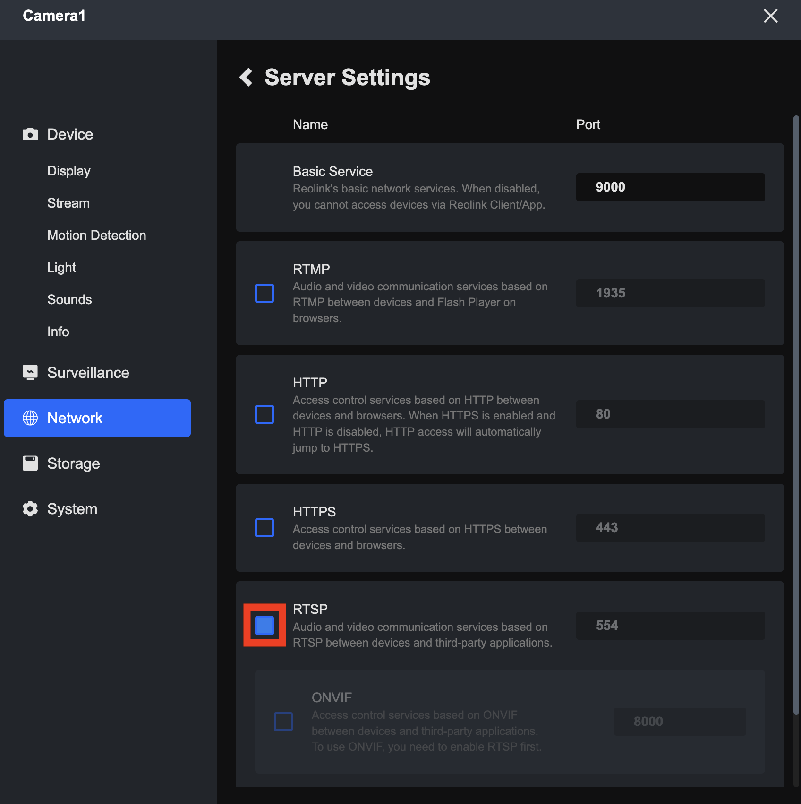
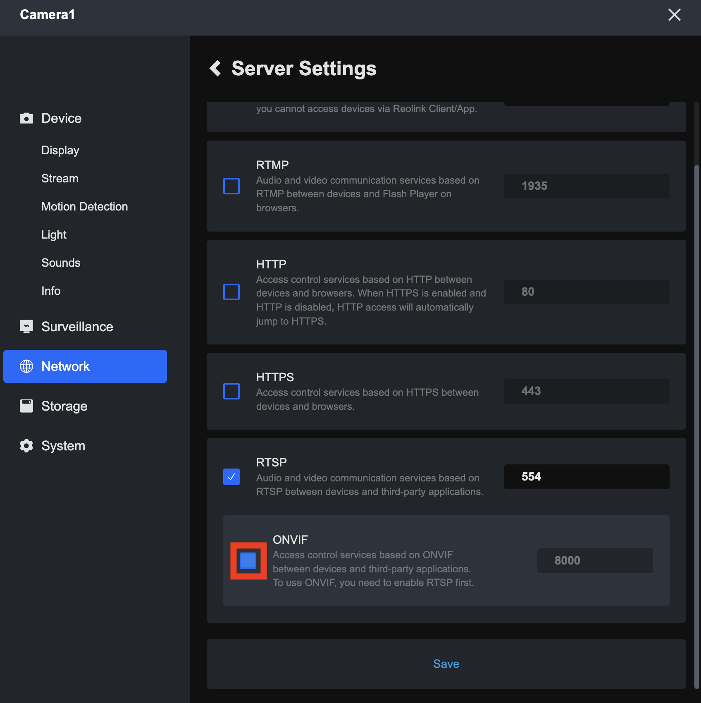

# Setting up Wireless Security Cameras
Created by: Shaun Altmann

## Table of Contents
- [Router](#router)
    - [Router Unboxing](#router-unboxing)
    - [Setting up the Router](#setting-up-the-router)
- [Security Camera](#security-camera)
    - [Unboxing the Security Camera](#unboxing-the-security-camera)
    - [Connecting the Camera to the Router](#connecting-the-camera-to-the-router)
    - [Checking Camera IP Address](#checking-camera-ip-address)
    - [Checking Camera Username + Resetting Password](#checking-camera-username--resetting-password)
    - [Stream Camera Data on Ubuntu VM](#stream-camera-data-on-ubuntu-vm)
    - [Stream Camera Data with ROS2 Iron](#stream-camera-data-with-ros2-iron)


## Router
### Router Unboxing
The router used for this project is the [TP-Link Archer AX55 Pro](https://www.tp-link.com/au/home-networking/wifi-router/archer-ax55-pro/).
In the box, there should be the router, a power adapter, and an ethernet cable (see below images).



### Setting up the Router
1. Extend all of the antennae on the router so they are pointing straight up.
2. Plug the power adapter into the router.
3. Press the power button on the router to turn it on (the power light should now be green).
4. Wait a couple of minutes for the 2.4G and 5G wireless network lights to turn green. Once this happens, you should be able to see the network in your laptop's list of available networks.
5. Join the 2.4GHz network (both networks have an identical name, except the 5G network contains the string "_5G" at the end of it).
    - The password for the network should be located on the back of the router.
6. Verify your connection by opening a new web browser tab, and entering "192.168.0.1" into the search bar. This should load a page similar to the following image.
    - 
7. Set the administrator password to the password on the back of the router (what you used to sign in to the network) + an exclamation mark.
    - Example: If you network password was `12345678`, set this password to `12345678!`.
8. Skip the setup by clicking the "Exit Setup" button.
9. You can see which devices are connected to the router network by clicking the "Clients" button in the main dashboard, as shown in the below image.
    - 

## Security Camera
### Unboxing the Security Camera
The security camera being used for this is the [Reolink RLC-840WA](https://reolink.com/au/product/rlc-840wa/). In the box, there should be the following (see below image):
- 1x Camera.
- 1x 1m Ethernet Cable.
- 1x 4.5m Power Extension Cable.
- 2x Camera Antennae.
- 1x Pack of Screws.
- 1x Power Adapter.
- 1x Surveillance Sticker.
- 1x Mounting Template.
- 1x Quick State Guide.


### Connecting the Camera to the Router
1. Screw the antennae into the sides of the camera.
2. Following the connection diagram on page 5 of the camera quick start guide (see below image), connect the ethernet plug of the camera to the LAN1 port on the router, and connect the power cable of the camera to power.
    - 
3. Test connections by connecting your laptop to the router network, and using the router interface (192.168.0.1) to identify the IP of the camera, and then pinging it.
    ``` bash
    # this example presumes that the camera IP is 192.168.0.184
    $ ping 192.168.0.184 -c 3
    ```
4. Download the Reolink Client from [here](https://reolink.com/au/software-and-manual/).
5. Open the Reolink Client App, agreeing to the Terms and Conditions.
6. Connect your laptop to the router network.
7. Select the camera connected to the network, as shown in the below image.
    - 
8. Set the password of the camera to the name of your camera, using exclamation marks to make up the minimum 8-character count, in this instance `Camera1!`. Also make sure to set the "Illegal Login Lockout" checkbox to `false` (the opposite of what is shown in the above image).
9. Set the name of the device to the original name (in this case `Camera1`).
10. Select the router 2.4GHz network to connect the camera to.
11. Quit the Reolink Client App, disconnect the camera from Ethernet, and then turn back on the Reolink Client App. You should now be able to see the live camera data which is being sent wirelessly from the camera to the router to your laptop.
12. In the Reolink Client App, enable RTSP data streaming for the camera (RTSP is a media streaming service which will allow us to get the live video stream from the camera in ROS).
    1. Open the Settings for the Camera.
        - 
    2. Go to the Network > Advanced Section.
        - 
    3. Go to the Server Settings Page.
        - 
    4. Enable RTSP, clicking 'Confirm' when the alert box appears.
        - 
    5. Enable ONVIF, clicking 'Confirm' when the alert box appears.
        - 
    6. Click 'Save' to save the network configuration changes.

### Checking Camera IP Address
TODO.

### Checking Camera Username + Resetting Password
TODO.

### Stream Camera Data on Ubuntu VM
1. Open Ubuntu VM.
2. Install FFMPEG Player.
    ``` bash
    $ sudo apt-get install ffmpeg
    ```
3. Connect the VM to the router network, and make sure it can ping the camera IP successfully (camera IP will be different now that it's wireless, so you will need to use Reolink Client App to work out the new IP).
    ``` bash
    $ ping 192.168.0.60 -c 3
    ```
    - If using Parallels to create the Ubuntu VM, make sure that the network source is set to "Bridged Network - WiFi".
4. Check the administrator username for the camera.
5. Stream the camera data with FFMPEG.
    ``` bash
    $ export CAMERA_UID="admin" # store camera uid
    $ export CAMERA_PWD="Camera1!" # store camera pwd
    $ export CAMERA_IP="192.168.0.60" # store camera ip
    $ export CAMERA_RTSP="rtsp://$CAMERA_UID:$CAMERA_PWD@$CAMERA_IP:554/h264Preview_01_main"
    $ ffmpeg -i $CAMERA_RTSP -f sdl "Camera Stream"

### Stream Camera Data with ROS2 Iron
1. Open Ubuntu 22.04 VM with ROS2 Iron installed.
2. Source ROS2:
    ``` bash
    $ source /opt/ros/iron/setup.sh # source_ros2
    ```
3. Install OpenCV:
    ``` bash
    $ sudo apt install libopencv-dev python3-opencv
    ```
4. Check dependencies (if any of these are not installed, install them):
    ``` bash
    $ ros2 pkg prefix rclpy
    $ ros2 pkg prefix image_transport
    $ ros2 pkg prefix cv_bridge
    $ ros2 pkg prefix sensor_msgs
    $ ros2 pkg prefix std_msgs
    ```
5. Create ROS2 Workspace for OpenCV Camera Streaming.
    ``` bash
    $ mkdir ~/camera_opencv_ws/src -p
    $ cd ~/camera_opencv_ws/src
    ```
6. Create ROS2 Package for streaming video data.
    ``` bash
    $ ros2 pkg create --build-type ament_python ros2_opencv --dependencies sensor_msgs std_msgs rclpy image_transport cv_bridge python3-opencv
    ```
7. Create Publisher and Subscriber Nodes for Package.
    1. Go to package source.
        ``` bash
        $ cd ~/camera_opencv_ws/src/ros2_opencv/ros2_opencv
        ```
    2. Create a file called `cameraPublisher.py`, and fill it with the code from this [cameraPublisher.py](files/cameraPublisher.py) file.
    3. Create a file called `subscriberImage.py`, and fill it with the code from this [subscriberImage.py](files/subscriberImage.py) file.
    4. Make the files executable.
        ``` bash
        $ chmod +x cameraPublisher.py
        $ chmod +x subscriberImage.py
        ```
    5. Go to the package base.
        ``` bash
        $ cd ~/camera_opencv_ws/src/ros2_opencv
        ```
    6. Edit `setup.py` so that it looks like this:
        ``` python
        ...
        setup(
            ...
            entry_points = {
                'console_scripts': [
                    'publisher_node=ros2_opencv.cameraPublisher:main',
                    'subscriber_node=ros2_opencv.subscriberImage:main',
                ],
            },
            ...
        )
        ```
    7. Install ROS dependencies.
        ``` bash
        $ cd ~/camera_opencv_ws
        $ rosdep install -i --from-paths src --rosdistro iron
        ```
    8. Build the workspace.
        ``` bash
        $ colcon build
        ```
9. Source the workspace.
    ``` bash
    $ cd ~/camera_opencv_ws
    $ source install/setup.bash # source_ws2
    ```
10. Create the camera stream environment variables.
    ``` bash
    $ export CAMERA_UID="admin" # store camera uid
    $ export CAMERA_PWD="Camera1!" # store camera pwd
    $ export CAMERA_IP="192.168.0.60" # store camera ip
    $ export CAMERA_RTSP="rtsp://$CAMERA_UID:$CAMERA_PWD@$CAMERA_IP:554/h264Preview_01_main"
    ```
11. Run the image publisher.
    ``` bash
    $ ros2 run ros2_opencv publisher_node
    ```
12. Open a new terminal, source the workspace, and run the subscriber.
    ``` bash
    $ cd ~/camera_opencv_ws
    $ source install/setup.bash # source_ws2
    $ ros2 run ros2_opencv subscriber_node
    ```
13. View the camera topic.
    ``` bash
    $ ros2 topic list # list all topics
    $ ros2 topic info /camera_image # get information about the topic
    $ ros2 topic echo /camera_image # stream topic data
    ```